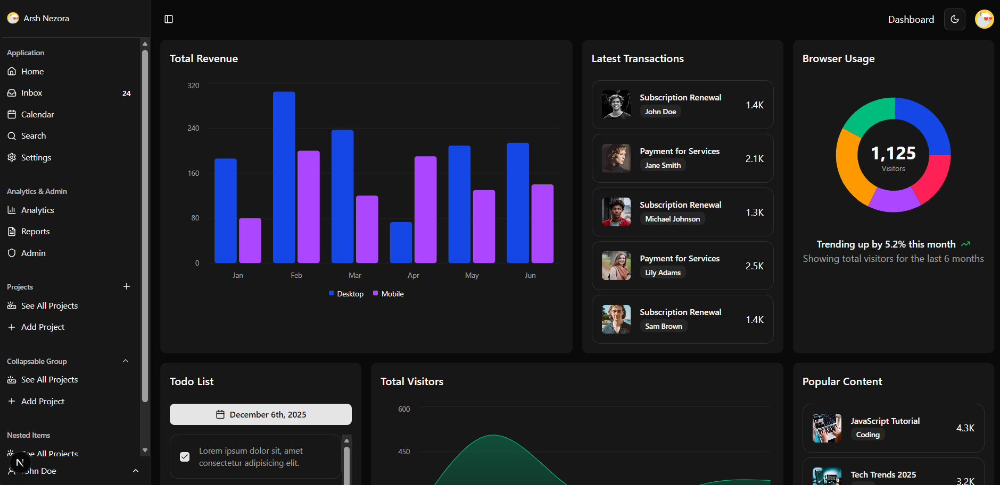
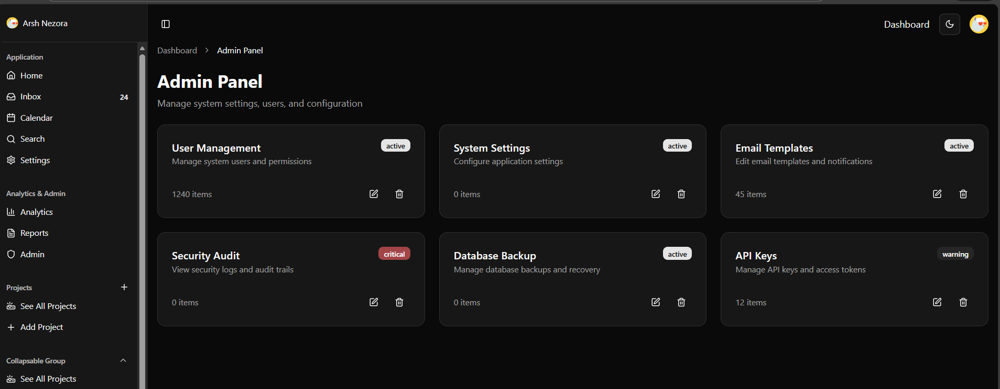

## Getting Started

First, run the development server:

```bash
npm run dev
# or
yarn dev
# or
pnpm dev
# or
bun dev
```
<h1>📊 Modern Admin Dashboard Shadcb,Next.JS,React-routing</h1>

A fully responsive, dark/light theme dashboard interface built with a modern UI design using Shadcn, Next.js.
It features analytics charts, project & task management, transaction lists, an admin panel, and more.
🖼 Screenshots
Dark Theme
(Dashboard, Analytics, Reports, Admin Panel)
<h1>Admin Dashboard</h1>

.

<h1>Analytics</h1>

.
<h1>admin Report</h1>

.
<h1>Admin Panel </h1>




<h1>🚀 Features</h1>
<h2>🌗 Light & Dark Theme</h2>

Switch seamlessly between light and dark mode with a single toggle.
Light Theme


📈 Analytics & Reports

Total Revenue (Desktop vs Mobile)

User Growth & Total Visitors

Conversion Rate & Active Sessions

Revenue trends with bar & line charts

💼 Admin Panel

Manage:

Users

System Settings

Email Templates

Security Audits

Database Backup

API Keys

🔔 Latest Transactions

View real-time subscription renewals, service payments, and user activities.

🗂 Projects Section

View All Projects

Add New Project

Nested project items

Collapsible sidebar groups

📝 Todo List

Simple task tracking widget with checkboxes and date selector.

📄 Reports Module

Download system-generated:

PDF reports

Excel summaries

Progress indicators


Add your screenshot files into a /screenshots folder in the repo.

🛠 Tech Stack
Technology	Purpose
React / Vue / Next.js	Main UI Framework (Specify your stack)
TailwindCSS	Styling & Theming
Recharts / Chart.js	Charts and visualizations
React Icons / Lucide Icons	Icons
LocalStorage / Context API	Theme & UI state management

Open [http://localhost:3000](http://localhost:3000) with your browser to see the result.

---

## Auth & Database setup 🔐

1. Install dependencies:

```bash
pnpm add @prisma/client next-auth bcrypt
pnpm add -D prisma
```

2. Copy `.env.example` to `.env` and set `NEXTAUTH_SECRET`.

3. Generate Prisma client and run the initial migration:

```bash
pnpm prisma:generate
pnpm prisma:migrate
```

4. Create a dev user (optional):

```bash
# Use a script or a DB UI like Prisma Studio
pnpm prisma studio
```

5. Run the dev server:

```bash
pnpm dev
```

Visit `/register` and `/login` to try the auth flow.

---


